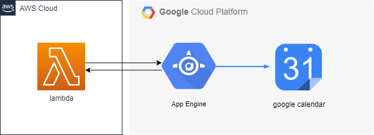

# googleCalendar
グーグルカレンダー取得

## システム構成



## inputのサンプル

```
{
  "body": "{\"calendar_id\":\"アカウント@gmail.com\", \"time_min\":\"2017-01-23T09:00:00+09:00\", \"time_max\":\"2017-01-23T12:24:07+09:00\"}"
}
```